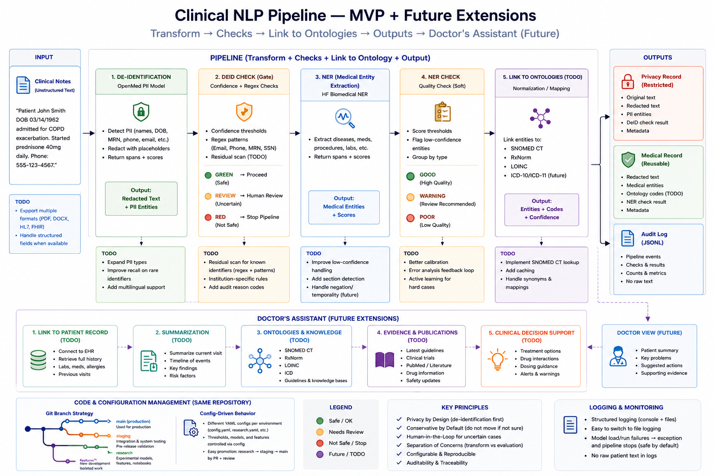

# Clinical NLP Pipeline — MVP

## Overview


## Pipeline

Two-stage pipeline for clinical note processing with configurable checks between stages.

```text
data/*.txt
    │
    ▼
pipeline/deid.py          OpenMed PII model → redacted text + PII spans
    │
pipeline/deid_check.py    confidence + regex checks
    │
    ├── RED     → privacy record written, Stage 2 skipped
    ├── REVIEW  → continue + warning
    └── GREEN   → continue
    │
    ▼
pipeline/ner.py           HuggingFace biomedical NER on redacted text
    │
pipeline/ner_check.py     soft check → GOOD / WARNING / POOR
    │
    ▼
outputs/privacy/          🔒 restricted  (original text + PII)
outputs/medical/          ✓ reusable     (redacted text + entities)
outputs/logs.jsonl        audit log      (no raw text)
```

## Setup

```bash
conda create -n clinical-nlp python=3.11 -y
conda activate clinical-nlp
pip install -r requirements.txt
```

## Run

```bash
# all notes
python main.py --config configs/config.yaml

# single note
python main.py --config configs/config.yaml --note data/note_001_copd.txt

```

## Project Structure

```text
main.py                    entrypoint + orchestration

pipeline/
    deid.py                Stage 1: OpenMed model-based de-identification
    deid_check.py          confidence + regex safety checks
    ner.py                 Stage 2: HuggingFace biomedical NER
    ner_check.py           soft quality checks

utils/
    config.py              load YAML config
    logging.py             structured logging

configs/
    config.yaml            default configuration
    research.yaml          lower thresholds for experimentation

data/
    *.txt                  synthetic clinical notes

outputs/
    privacy/               one JSON per note (contains original text)
    medical/               one JSON per note (safe to share)
    logs.jsonl             structured audit log

notebooks/
    01_evaluation.ipynb    charts and summary statistics
    02_llm_evaluation.ipynb LLM-assisted output review

tests/
    test_dependencies.py   lightweight smoke tests
```

## Config Reference

```yaml
deid:
  model: "OpenMed/OpenMed-PII-GTEMed-Base-149M-v1"

deid_check:
  low_threshold: 0.60
  high_threshold: 0.85
  regex: true

ner:
  model: "d4data/biomedical-ner-all"
  min_score: 0.30

ner_check:
  review_threshold: 0.60
```

## Output Files

**Privacy record** (`outputs/privacy/<note_id>_privacy.json`)

* original_text
* redacted_text
* pii_entities
* deid_check

**Medical record** (`outputs/medical/<note_id>_medical.json`)

* redacted_text
* entities
* ner_check

Both files share the same `record_id` UUID.

## Evaluation

```bash
jupyter notebook notebooks/
```

* `01_evaluation.ipynb` – gate results, entity counts, confidence distributions
* `02_llm_evaluation.ipynb` – LLM-assisted review of de-identification and entity extraction quality


